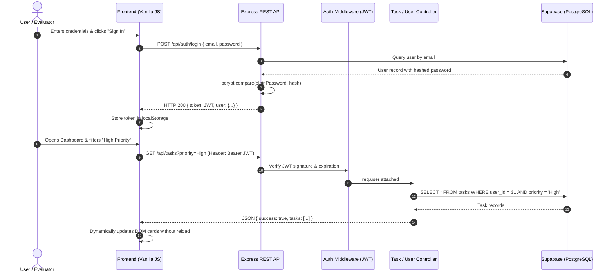

# TaskFlow — Academic Semester Project
> **Tagline:** *Plan better. Work smarter.*  
> **Domain:** Web Development & Cloud Database Systems  
> **Architecture:** Modern 3-Tier Client-Server Architecture (REST API + Supabase PostgreSQL)

---

## 1. Project Abstract

**TaskFlow** is a modern, responsive, and secure **Individual Task Management System** developed as a college semester academic project. Built to simulate a commercial SaaS productivity suite, TaskFlow eliminates clutter to provide students and professionals with intuitive task lifecycle management, priority tracking, due date monitoring, and real-time aggregated metrics.

The project demonstrates mastery of fundamental software engineering principles:
- **Clean Separation of Concerns (MVC Pattern)**
- **Stateless Authentication via JSON Web Tokens (JWT)**
- **Cryptographic Password Protection via Bcrypt Hashing**
- **Relational Cloud Database Modeling with Supabase (PostgreSQL)**
- **Fluid, human-designed Vanilla HTML5/CSS3/JavaScript Frontend (No heavy framework bloat)**

---

## 2. System Architecture & Data Flow



---

## 3. Technology Stack

| Layer | Technology | Key Capabilities & Rationale |
| :--- | :--- | :--- |
| **Frontend** | HTML5, CSS3, Vanilla JS (ES6+) | Blazing fast render speed, zero build-step overhead, readable for academic viva. |
| **Typography** | Plus Jakarta Sans | Modern, human-designed geometric sans-serif for premium SaaS feel. |
| **Backend** | Node.js & Express.js | Asynchronous, non-blocking I/O event-driven RESTful API endpoints. |
| **Database** | Supabase (PostgreSQL) | Managed relational PostgreSQL engine with foreign keys, cascading deletes & B-tree indexes. |
| **Auth** | JWT & BcryptJS | Industry-standard stateless token authentication and salted one-way hashing. |
| **Security** | CORS & Dotenv | Cross-origin resource sharing controls and strict credential isolation. |

---

## 4. Database Design (PostgreSQL Relational Schema)

### Entity-Relationship Overview
- **One User → Many Tasks** (`users.id (1) ──── (N) tasks.user_id`)
- Foreign key with `ON DELETE CASCADE` ensures all linked tasks are wiped if an account is removed.

### Tables

#### `users` Table
| Column | Type | Constraints | Description |
| :--- | :--- | :--- | :--- |
| `id` | `UUID` | `PRIMARY KEY DEFAULT gen_random_uuid()` | Unique user identifier |
| `name` | `VARCHAR(100)` | `NOT NULL` | Full Name of the student |
| `email` | `VARCHAR(255)` | `UNIQUE, NOT NULL` | Unique user email address |
| `password`| `VARCHAR(255)` | `NOT NULL` | Bcrypt hashed string (10 rounds) |
| `created_at`| `TIMESTAMPTZ`| `DEFAULT NOW()` | Account creation timestamp |

#### `tasks` Table
| Column | Type | Constraints | Description |
| :--- | :--- | :--- | :--- |
| `id` | `UUID` | `PRIMARY KEY DEFAULT gen_random_uuid()` | Unique task identifier |
| `user_id` | `UUID` | `NOT NULL, REFERENCES users(id) ON DELETE CASCADE` | Owner ID |
| `title` | `VARCHAR(200)` | `NOT NULL` | Task title |
| `description` | `TEXT` | `DEFAULT ''` | Sub-tasks, notes, or details |
| `priority` | `VARCHAR(10)` | `CHECK (priority IN ('Low', 'Medium', 'High'))` | Importance level |
| `status` | `VARCHAR(20)` | `CHECK (status IN ('Pending', 'In Progress', 'Completed'))` | Workflow state |
| `due_date` | `TIMESTAMPTZ` | `NOT NULL` | Deadline timestamp |
| `created_at`| `TIMESTAMPTZ`| `DEFAULT NOW()` | Creation timestamp |
| `updated_at`| `TIMESTAMPTZ`| `DEFAULT NOW()` | Auto-updated via SQL trigger |

### Indexes & Performance Optimizations
```sql
CREATE INDEX idx_tasks_user_id ON tasks(user_id);
CREATE INDEX idx_tasks_status ON tasks(status);
CREATE INDEX idx_tasks_priority ON tasks(priority);
CREATE INDEX idx_tasks_due_date ON tasks(due_date);
CREATE INDEX idx_users_email ON users(email);
```

---

## 5. REST API Specifications

### Authentication Routes
- `POST /api/auth/register` — Registers a new user account with validated inputs and hashed password.
- `POST /api/auth/login` — Verifies credentials, compares bcrypt hash, and issues signed JWT.

### Task Management Routes (Protected with `Bearer <JWT>`)
- `GET /api/tasks` — Fetches tasks scoped to authenticated user with optional `?status=`, `?priority=`, `?search=`, `?sort=`.
- `GET /api/tasks/stats/summary` — **Dynamic live calculation** returning counts of Total, Pending, In Progress, Completed, and High Priority tasks.
- `GET /api/tasks/:id` — Fetches a single task by ID verifying ownership.
- `POST /api/tasks` — Creates a new task with title, description, priority, status, and due date.
- `PUT /api/tasks/:id` — Edits task fields.
- `PATCH /api/tasks/:id/status` — Quick status toggle (`Pending` ↔ `In Progress` ↔ `Completed`).
- `DELETE /api/tasks/:id` — Permanently removes task.

### User Profile Routes (Protected with `Bearer <JWT>`)
- `GET /api/users/profile` — Retrieves active user details.
- `PUT /api/users/profile` — Updates user name and securely changes password.

---

## 6. Project Directory Structure

```
task-management-system/
├── backend/
│   ├── config/
│   │   └── supabase.js           # Supabase client SDK & fallback demo mode
│   ├── controllers/
│   │   ├── authController.js     # User registration & JWT login
│   │   ├── taskController.js     # Full CRUD, status patches & dynamic statistics
│   │   └── userController.js     # Profile retrieval & credential update
│   ├── middleware/
│   │   ├── authMiddleware.js     # JWT Bearer verification & user extraction
│   │   └── errorMiddleware.js    # Clean JSON error responses
│   ├── routes/
│   │   ├── authRoutes.js         # /api/auth endpoints
│   │   ├── taskRoutes.js         # /api/tasks endpoints
│   │   └── userRoutes.js         # /api/users endpoints
│   ├── package.json              # Express, @supabase/supabase-js, bcryptjs, jwt
│   └── server.js                 # Express server & static frontend serving
├── database/
│   └── schema.sql                # Complete Supabase PostgreSQL DDL, triggers & seeds
├── frontend/
│   ├── assets/
│   │   └── logo.svg              # Minimal geometric TaskFlow "T" logo
│   ├── css/
│   │   └── style.css             # Plus Jakarta Sans, design tokens, micro-interactions
│   ├── js/
│   │   ├── api.js                # Centralized Fetch API client with auto-token injection
│   │   ├── auth.js               # Login, registration, strength meter & validation
│   │   └── app.js                # Dashboard orchestration, search, filters & modals
│   ├── index.html                # Split-screen Login screen
│   ├── register.html             # Split-screen Register screen
│   └── dashboard.html            # Main productivity Dashboard screen
├── .env                          # Local active environment variables
├── .env.example                  # Environment configuration template
├── .gitignore                    # Excludes node_modules and .env
└── README.md                     # Academic project documentation & viva guide
```

---

## 7. Step-by-Step Installation & Execution

### Prerequisites
- Node.js (v16 or higher) installed on your system.
- Modern web browser (Chrome, Edge, Firefox, Safari).

### Step 1: Install Dependencies
Open your terminal in the `backend/` directory:
```bash
cd backend
npm install
```

### Step 2: Configure Supabase (Optional for Cloud DB)
1. Sign in to your [Supabase Dashboard](https://supabase.com).
2. Create a new project named `TaskFlow`.
3. Open the **SQL Editor** in Supabase, paste the contents of `database/schema.sql`, and click **Run**.
4. Navigate to **Project Settings → API** and copy:
   - `Project URL`
   - `anon public key` (or `service_role key`)
5. Update your `.env` file:
   ```env
   PORT=5000
   SUPABASE_URL=https://your-project.supabase.co
   SUPABASE_KEY=your-supabase-key
   ```
*(Note: If Supabase credentials are not set yet, TaskFlow automatically starts in **Demo Memory Mode** with realistic academic demo tasks so evaluators can test immediately without any blocker!)*

### Step 3: Run the Application
In the `backend/` directory:
```bash
npm start
```

Open your browser and visit:
```
http://localhost:5000
```

---

## 8. Faculty Demonstration Checklist (15 Steps)

Follow this structured demonstration during academic evaluation:

1. **Open Website:** Navigate to `http://localhost:5000`. Observe the premium split-screen design, TaskFlow "T" logo, and branding tagline *"Plan better. Work smarter."*
2. **Register New Account:** Click *"Create one"*, enter Full Name (e.g. `Harshika Sharma`), Email (`harshika@example.com`), and watch the **live Password Strength Meter** update.
3. **Password Confirmation:** Try typing mismatched passwords to show client-side validation, then match them and submit.
4. **Login:** Enter the credentials, test the **Show/Hide password toggle** (eye icon), and click **Sign In**.
5. **View Dashboard:** Note the personalized dynamic greeting (*"Good afternoon, Harshika"*), sidebar navigation, and clean SaaS layout.
6. **Check Dynamic Statistics:** Notice the 4 stat cards (**Total Tasks, Pending, In Progress, Completed**) loaded dynamically from the database.
7. **Create a Task:** Click **+ Add Task**. Fill in:
   - Title: `Complete DSA Assignment`
   - Priority: `High`
   - Status: `Pending`
   - Due Date: Pick a date next week
   - Submit and observe the smooth toast notification: *"Task created successfully."*
8. **Verify Stat Card Update:** Observe the Total and Pending stat counts increment immediately without page reload.
9. **View Task Details:** Click the Eye icon on the task card to open the **Task Details Modal** displaying title, description, priority badge, and formatted timestamps.
10. **Edit Task:** Click **Edit Task**, change the status to `In Progress`, and click **Save Changes**.
11. **Mark as Completed:** Click the checkmark icon on the task card. Notice the card gets a subtle green accent and the title receives a clean completion strike.
12. **Test Filter Pills:** Click **Completed** filter pill to view only completed items; click **High Priority** to isolate urgent tasks.
13. **Real-time Search:** Type `DSA` in the search bar and see results filter instantly as you type.
14. **Delete a Task:** Click the Trash icon on a task, inspect the **Delete Confirmation Modal**, and confirm deletion.
15. **Settings & Logout:** Click **Settings** in the sidebar, view the profile details, and click **Log Out** to return securely to the sign-in screen.

---

## 9. Faculty Viva Q&A Guide

### Q1: Why did you choose Supabase over a traditional local database?
**Answer:** Supabase gives us the full power of a robust, ACID-compliant **PostgreSQL relational database** in the cloud. Unlike local setups, it eliminates local database daemon dependencies, provides automated schema migrations via the SQL Editor, and enables seamless deployment with enterprise-grade connection pooling and indexing.

### Q2: How does stateless JWT authentication work in this application?
**Answer:** When a user logs in, the backend verifies their password hash and creates a cryptographically signed JSON Web Token (JWT) containing the user ID and expiration time. The frontend stores this token in `localStorage` and transmits it in the `Authorization: Bearer <token>` header for all subsequent REST requests. The backend `protect` middleware verifies the digital signature before allowing access to any task route.

### Q3: Why is password hashing essential and how is bcrypt used here?
**Answer:** Passwords must never be stored in plain text. Bcrypt uses a **salt** (random bits added before hashing) and an adaptive work factor (10 rounds in our project). This prevents Rainbow Table attacks and makes brute-force dictionary attacks computationally infeasible.

### Q4: What design pattern does this project follow?
**Answer:** It strictly adheres to the **MVC (Model-View-Controller)** pattern:
- **Model:** PostgreSQL relational tables (`users` and `tasks` in Supabase with foreign keys).
- **View:** Pure semantic HTML5 and responsive CSS3 rendered directly in the client.
- **Controller:** Express controller functions (`authController`, `taskController`, `userController`) handling business logic, validation, and database operations.

### Q5: Why build the frontend in Vanilla JavaScript instead of React?
**Answer:** Vanilla JavaScript demonstrates a solid understanding of core DOM manipulation, asynchronous Fetch API promises, and event delegation without the overhead of heavy virtual DOM libraries or complex build pipelines. It keeps the codebase 100% transparent and easy to explain during academic evaluation.
