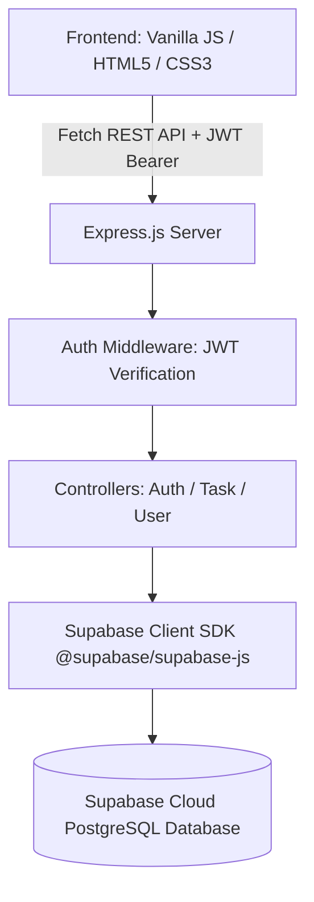

# Implementation Plan — TaskFlow (Semester Project with Supabase)

A complete, polished, and professional **Task Management System** built with **Node.js, Express, Supabase (PostgreSQL), JWT authentication**, and a bespoke **Vanilla HTML5/CSS3/JavaScript** frontend designed for academic semester evaluation and faculty viva demonstration.

---

## User Review Required

> [!IMPORTANT]
> **Database: Supabase (PostgreSQL)**
> As requested, the system now uses **Supabase** as the cloud database engine instead of MongoDB.
> - **Backend integration:** Uses `@supabase/supabase-js` configured via `SUPABASE_URL` and `SUPABASE_ANON_KEY` / `SUPABASE_SERVICE_ROLE_KEY` in `.env`.
> - **Academic Database Design:** We provide a ready-to-run `database/schema.sql` script with relational schemas for `users` and `tasks` (Foreign Keys, cascading deletes, indexes, timestamps).
> - **Out-of-the-box Viva Demonstration:** The backend will seamlessly connect to your Supabase project. We will also include clear setup steps to paste the SQL into the Supabase SQL Editor in 30 seconds.

---

## Architecture & Data Flow



### Relational Schema (PostgreSQL on Supabase)

#### Table: `users`
- `id`: `UUID PRIMARY KEY DEFAULT gen_random_uuid()`
- `name`: `TEXT NOT NULL`
- `email`: `TEXT UNIQUE NOT NULL`
- `password`: `TEXT NOT NULL` (hashed with bcrypt)
- `created_at`: `TIMESTAMPTZ DEFAULT NOW()`

#### Table: `tasks`
- `id`: `UUID PRIMARY KEY DEFAULT gen_random_uuid()`
- `user_id`: `UUID NOT NULL REFERENCES users(id) ON DELETE CASCADE`
- `title`: `TEXT NOT NULL`
- `description`: `TEXT`
- `priority`: `TEXT CHECK (priority IN ('Low', 'Medium', 'High')) DEFAULT 'Medium'`
- `status`: `TEXT CHECK (status IN ('Pending', 'In Progress', 'Completed')) DEFAULT 'Pending'`
- `due_date`: `TIMESTAMPTZ NOT NULL`
- `created_at`: `TIMESTAMPTZ DEFAULT NOW()`
- `updated_at`: `TIMESTAMPTZ DEFAULT NOW()`

**Indexes:**
- `CREATE INDEX idx_tasks_user_id ON tasks(user_id);`
- `CREATE INDEX idx_tasks_status ON tasks(status);`

---

## Proposed Project Structure

```
task-management-system/
├── backend/
│   ├── config/
│   │   └── supabase.js           # Supabase client initialization & health check
│   ├── controllers/
│   │   ├── authController.js     # User registration & JWT login with Supabase
│   │   ├── taskController.js     # CRUD, status update, dynamic statistics
│   │   └── userController.js     # Profile retrieval & update
│   ├── middleware/
│   │   ├── authMiddleware.js     # JWT Bearer verification & req.user attachment
│   │   └── errorMiddleware.js    # Clean, sanitized JSON error responses
│   ├── routes/
│   │   ├── authRoutes.js         # /api/auth routes
│   │   ├── taskRoutes.js         # /api/tasks routes
│   │   └── userRoutes.js         # /api/users routes
│   ├── package.json              # Express, @supabase/supabase-js, jsonwebtoken, bcryptjs, cors, dotenv
│   └── server.js                 # Express server & static file serving
├── database/
│   └── schema.sql                # Complete Supabase PostgreSQL schema & demo seed queries
├── frontend/
│   ├── assets/
│   │   └── logo.svg              # Custom modern TaskFlow "T" logo
│   ├── css/
│   │   └── style.css             # Plus Jakarta Sans, design tokens, micro-interactions
│   ├── js/
│   │   ├── api.js                # Reusable Fetch API client with automatic JWT header
│   │   ├── auth.js               # Login, registration, password validation & session handling
│   │   └── app.js                # Full Dashboard orchestration (CRUD, search, filters, stats, modals)
│   ├── index.html                # Premium split-screen Login page
│   ├── register.html             # Matching premium Registration page
│   └── dashboard.html            # Main productivity Dashboard with sidebar, stats & settings
├── .env.example                  # Environment configuration template with Supabase keys
├── .gitignore                    # Excludes node_modules, .env, and OS files
└── README.md                     # Academic project documentation, DFD, Viva Q&A & Demonstration guide
```

---

## Proposed Changes

### Database Layer
#### [NEW] [database/schema.sql](file:///c:/Users/harshika/OneDrive/Desktop/Project/database/schema.sql)
- Complete PostgreSQL DDL for Supabase:
  - `users` table with UUID primary key and email constraint
  - `tasks` table with foreign key `user_id` referencing `users(id)`
  - Indexes on `user_id` and `status` for fast query performance
  - Auto-updating `updated_at` trigger function
  - Realistic academic seed tasks for demo

### Backend Layer
#### [NEW] [backend/package.json](file:///c:/Users/harshika/OneDrive/Desktop/Project/backend/package.json)
- Dependencies: `express`, `@supabase/supabase-js`, `jsonwebtoken`, `bcryptjs`, `cors`, `dotenv`.

#### [NEW] [backend/config/supabase.js](file:///c:/Users/harshika/OneDrive/Desktop/Project/backend/config/supabase.js)
- Initializes `@supabase/supabase-js` using `SUPABASE_URL` and `SUPABASE_KEY` / `SUPABASE_SERVICE_ROLE_KEY`.
- Includes connection health check and helpful terminal diagnostics.

#### [NEW] [backend/middleware/authMiddleware.js](file:///c:/Users/harshika/OneDrive/Desktop/Project/backend/middleware/authMiddleware.js)
- Extracts `Bearer <token>`, verifies JWT secret, checks user in Supabase `users` table, attaches `req.user`.

#### [NEW] [backend/middleware/errorMiddleware.js](file:///c:/Users/harshika/OneDrive/Desktop/Project/backend/middleware/errorMiddleware.js)
- Centralized error response formatter `{ success: false, message: '...' }`.

#### [NEW] [backend/controllers/authController.js](file:///c:/Users/harshika/OneDrive/Desktop/Project/backend/controllers/authController.js)
- `registerUser`: Validates input, verifies email uniqueness in Supabase, hashes password with `bcryptjs`, inserts into `users`, generates JWT.
- `loginUser`: Queries user by email in Supabase, compares password hash, returns JWT and user profile.

#### [NEW] [backend/controllers/taskController.js](file:///c:/Users/harshika/OneDrive/Desktop/Project/backend/controllers/taskController.js)
- `getTasks`: Queries Supabase `tasks` table filtered strictly by `user_id = req.user.id`. Supports query parameters for `status`, `priority`, `search` (ilike title or description), and `sort` (due_date, priority, created_at).
- `getTaskById`: Retrieves single task owned by `req.user.id`.
- `createTask`: Inserts new record into Supabase `tasks` with `user_id = req.user.id`.
- `updateTask`: Updates task attributes for matching `id` and `user_id`.
- `deleteTask`: Deletes task for matching `id` and `user_id`.
- `updateTaskStatus`: Quick status patch (`Pending` -> `In Progress` -> `Completed`).
- `getTaskStats`: Aggregates dynamic statistics directly from Supabase:
  - Total Tasks
  - Pending Tasks
  - In Progress Tasks
  - Completed Tasks
  - High Priority Tasks

#### [NEW] [backend/controllers/userController.js](file:///c:/Users/harshika/OneDrive/Desktop/Project/backend/controllers/userController.js)
- `getUserProfile`: Returns current user details.
- `updateUserProfile`: Updates name and optionally re-hashes password.

#### [NEW] [backend/routes/authRoutes.js](file:///c:/Users/harshika/OneDrive/Desktop/Project/backend/routes/authRoutes.js)
- `POST /api/auth/register`
- `POST /api/auth/login`

#### [NEW] [backend/routes/taskRoutes.js](file:///c:/Users/harshika/OneDrive/Desktop/Project/backend/routes/taskRoutes.js)
- `GET /api/tasks`
- `GET /api/tasks/stats/summary`
- `GET /api/tasks/:id`
- `POST /api/tasks`
- `PUT /api/tasks/:id`
- `DELETE /api/tasks/:id`
- `PATCH /api/tasks/:id/status`

#### [NEW] [backend/routes/userRoutes.js](file:///c:/Users/harshika/OneDrive/Desktop/Project/backend/routes/userRoutes.js)
- `GET /api/users/profile`
- `PUT /api/users/profile`

#### [NEW] [backend/server.js](file:///c:/Users/harshika/OneDrive/Desktop/Project/backend/server.js)
- Configures CORS, JSON body parser, registers API routes, serves static frontend from `frontend/` directory.

---

### Frontend Layer

#### [NEW] [frontend/assets/logo.svg](file:///c:/Users/harshika/OneDrive/Desktop/Project/frontend/assets/logo.svg)
- Elegant geometric monogram icon featuring "T" in `#14243D` and `#3B82F6`.

#### [NEW] [frontend/css/style.css](file:///c:/Users/harshika/OneDrive/Desktop/Project/frontend/css/style.css)
- Complete design system with Plus Jakarta Sans typography.
- Exact color tokens: `#14243D`, `#3B82F6`, `#F7F9FC`, `#FFFFFF`, `#172033`, `#667085`, `#16A34A`, `#F59E0B`, `#DC2626`, `#E5E7EB`.
- Split-screen auth layout, responsive sidebar with mobile drawer, modern task cards with status and priority badges, modal dialogs, and toast notifications.

#### [NEW] [frontend/js/api.js](file:///c:/Users/harshika/OneDrive/Desktop/Project/frontend/js/api.js)
- Centralized Fetch API utility with Bearer JWT token handling, 401 handling, and error formatting.

#### [NEW] [frontend/js/auth.js](file:///c:/Users/harshika/OneDrive/Desktop/Project/frontend/js/auth.js)
- Client-side validation, password toggle, password strength meter, register & login form management.

#### [NEW] [frontend/js/app.js](file:///c:/Users/harshika/OneDrive/Desktop/Project/frontend/js/app.js)
- Dashboard logic: real-time search, filter pills, sorting, dynamic stats rendering, task creation/editing/deletion modals, toast notifications, profile/settings.

#### [NEW] [frontend/index.html](file:///c:/Users/harshika/OneDrive/Desktop/Project/frontend/index.html)
- Split-screen Login view.

#### [NEW] [frontend/register.html](file:///c:/Users/harshika/OneDrive/Desktop/Project/frontend/register.html)
- Split-screen Register view.

#### [NEW] [frontend/dashboard.html](file:///c:/Users/harshika/OneDrive/Desktop/Project/frontend/dashboard.html)
- Main TaskFlow dashboard screen.

---

### Configuration & Viva Documentation

#### [NEW] [.env.example](file:///c:/Users/harshika/OneDrive/Desktop/Project/.env.example)
- Configuration template with `PORT=5000`, `SUPABASE_URL`, `SUPABASE_KEY`, `JWT_SECRET`.

#### [NEW] [.gitignore](file:///c:/Users/harshika/OneDrive/Desktop/Project/.gitignore)
- Standard ignore file for Node.js.

#### [NEW] [README.md](file:///c:/Users/harshika/OneDrive/Desktop/Project/README.md)
- Complete academic documentation containing:
  - System Architecture & Data Flow Diagram
  - Supabase Setup Guide (step-by-step SQL execution in Supabase dashboard)
  - REST API Documentation
  - Database ER Diagram & Relational Schema
  - Viva Q&A Guide (explaining Supabase vs Traditional DBs, Relational Foreign Keys, JWT Auth, Bcrypt, MVC pattern)
  - Complete 15-step demonstration checklist for faculty presentation.

---

## Verification Plan

### Automated / API Verification
1. Install dependencies in `backend/` (`express`, `@supabase/supabase-js`, `jsonwebtoken`, `bcryptjs`, `cors`, `dotenv`).
2. Run database schema tests / mock verification.
3. Validate all endpoints (`POST /api/auth/register`, `POST /api/auth/login`, `GET /api/tasks`, `POST /api/tasks`, `GET /api/tasks/stats/summary`, `PATCH /api/tasks/:id/status`, `PUT /api/tasks/:id`, `DELETE /api/tasks/:id`).

### Manual Demonstration Flow Verification
1. Registration with password confirmation and strength indicator.
2. Login with JWT generation and redirect to dashboard.
3. Verify dynamic greeting, real-time statistics cards.
4. Create tasks with High/Medium/Low priority and due date.
5. Filter by status (Pending, In Progress, Completed, High Priority).
6. Search tasks in real time by title and description.
7. Edit task, update status, view details modal.
8. Delete task with confirmation modal.
9. Settings tab to update profile.
10. Logout and verify session cleanup.
